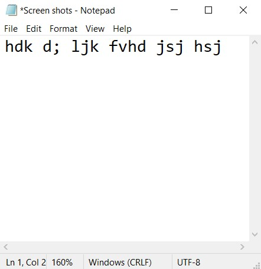
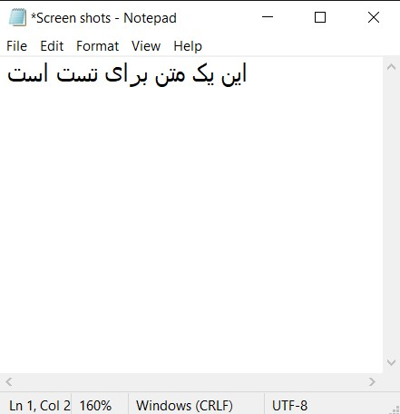
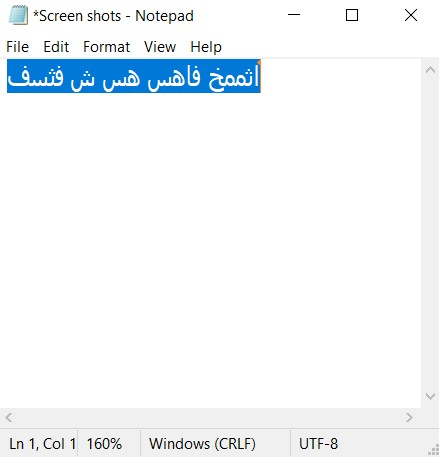
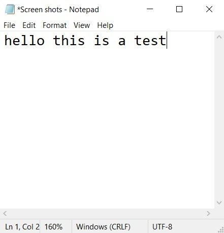

  

# 🧙 LitWiz

> ✨ A little wizard using light magic to fix mistyped text.

> A Windows utility for converting selected text between Persian and English keyboard layouts.

---

## ✨ Features

- 🔄 Convert selected text instantly
- ⌨️ Global **F7** hotkey
- 🖥️ Runs in the background

---

## 📸 Screenshots

### English → Persian

  
  

Before &nbsp;&nbsp;&nbsp;&nbsp;&nbsp;&nbsp;&nbsp;&nbsp;&nbsp;&nbsp;&nbsp;&nbsp;&nbsp;&nbsp;&nbsp;&nbsp;&nbsp;&nbsp;&nbsp;&nbsp;&nbsp;&nbsp;&nbsp;&nbsp;&nbsp;&nbsp;&nbsp;&nbsp; After

### Persian → English

  
  

Before &nbsp;&nbsp;&nbsp;&nbsp;&nbsp;&nbsp;&nbsp;&nbsp;&nbsp;&nbsp;&nbsp;&nbsp;&nbsp;&nbsp;&nbsp;&nbsp;&nbsp;&nbsp;&nbsp;&nbsp;&nbsp;&nbsp;&nbsp;&nbsp;&nbsp;&nbsp;&nbsp;&nbsp; After

---

## 📋 Requirements

- Windows 10/11

---

## 🚀 Getting Started

1. Download the latest release.
2. Run `LitWiz.exe`.
3. Select any Persian or English text.
4. Press **F7**.
5. Done!

---

## 🗺️ Roadmap

- [x] MVP release
- [x] Global hotkey
- [x] Background execution

- [ ] Keyboard layout switcher
- [ ] Auto-start with Windows
- [ ] Notifications
- [ ] Settings window
- [ ] Custom hotkeys
- [ ] Automatic updates

---

## 📄 License
MIT License